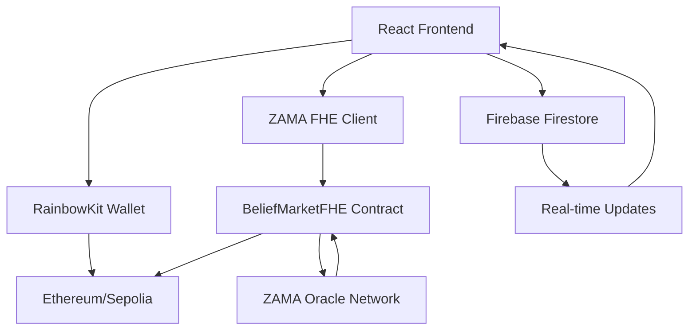

# Conviction Markets

A decentralized platform for opinion markets, hot takes, and belief-based betting using Fully Homomorphic Encryption (FHE) for privacy-preserving transactions.

## 🚀 Features

### **Privacy-First Betting**
- **Encrypted Betting**: Place confidential bets using ZAMA FHEVM with zero knowledge leakage
- **Homomorphic Encryption**: Vote tallies computed without revealing individual choices
- **Temporal Privacy**: Results hidden until official market resolution
- **Cryptographic Verification**: Oracle-based decryption with signature validation

### **Prediction Markets**
- **Binary Markets**: Yes/No prediction markets on any topic
- **Fixed Stake Betting**: Equal betting amounts set by market creators (min 0.005 ETH)
- **Flexible Duration**: Markets from 5 minutes to 30 days
- **Proportional Payouts**: Winners split prize pool based on participation

### **Social Features**
- **Real-time Activity**: Live market updates and community activity feeds
- **Comment System**: Discussion threads for each market
- **Leaderboards**: User rankings based on market participation
- **Community Engagement**: Social betting with gamified elements

### **Web3 Integration**
- **Multi-Wallet Support**: MetaMask, Rainbow, and other Web3 wallets
- **Gas Optimization**: Efficient smart contract interactions
- **Transaction Safety**: Comprehensive error handling and validation
- **Cross-Platform**: Responsive design for mobile and desktop

## 🛠️ Tech Stack

### **Core Technologies**
- **Frontend**: React 19.1.0 + TypeScript 5.8.3 + Vite 6.3.5
- **Styling**: Tailwind CSS 4.1.8 with custom mint/orange design system
- **Smart Contracts**: Solidity ^0.8.24 with ZAMA FHE integration
- **Blockchain**: Ethereum Sepolia testnet + ZAMA FHEVM
- **Privacy Layer**: ZAMA Fully Homomorphic Encryption (FHE)

### **Web3 Integration**
- **Wallet Connection**: RainbowKit 2.2.8 + Wagmi 2.15.6
- **Ethereum Interaction**: Ethers.js 5.8.0
- **Contract Development**: Hardhat 2.25.0
- **FHE Client**: ZAMA fhevm-core libraries


## 🏃‍♂️ Quick Start

1. **Clone the repository**
   ```bash
   git clone <repository-url>
   cd conviction-app
   ```

2. **Install dependencies**
   ```bash
   npm install
   ```

3. **Set up environment variables**
   ```bash
   cp .env.example .env
   # Add your WalletConnect Project ID
   VITE_WALLETCONNECT_PROJECT_ID=your_project_id
   ```

4. **Start development server**
   ```bash
   npm run dev
   ```

5. **Open your browser**
   Navigate to `http://localhost:5173`

## 🔧 Development

- **Build**: `npm run build`
- **Preview**: `npm run preview`
- **Lint**: `npm run lint`

## 📚 Documentation

Visit `/docs` in the app for comprehensive documentation including:
- Architecture overview
- Usage guide
- FAQ
- Technical references

## 🏗️ Technical Architecture

### Smart Contract Architecture

The platform is built around the `BeliefMarketFHE` smart contract which leverages **ZAMA's Fully Homomorphic Encryption (FHE)** for privacy-preserving betting:

```solidity
contract BeliefMarketFHE {
    struct BetInfo {
        address creator;
        uint256 platformStake;    // 0.02 ETH platform fee
        uint256 voteStake;        // Min 0.005 ETH per bet
        uint256 expiryTime;       // 5 minutes to 30 days
        bool isResolved;
        euint64 yesVotes;         // Encrypted vote tally
        euint64 noVotes;          // Encrypted vote tally
        uint64 revealedYes;       // Decrypted results
        uint64 revealedNo;        // Decrypted results
        uint256 prizePool;        // Total ETH staked
        bool yesWon;              // Winner determination
    }
}
```

### Privacy-Preserving Betting Mechanism

#### 1. **Encrypted Vote Submission**
- All votes are encrypted client-side using ZAMA FHE before blockchain submission
- Vote choices (Yes/No) and amounts remain hidden until market resolution
- Uses `euint64` encrypted integers for vote tallies

#### 2. **Homomorphic Vote Aggregation**
```solidity
// Votes are aggregated without revealing individual choices
bet.yesVotes = FHE.add(bet.yesVotes, FHE.select(isYes, weight, zero));
bet.noVotes = FHE.add(bet.noVotes, FHE.select(isNo, weight, zero));
```

#### 3. **Decryption & Resolution Process**
- After market expiry, only the creator can request vote decryption
- ZAMA oracle service decrypts the tallies via `requestDecryption()`
- Results are revealed through a cryptographic callback mechanism

### Market Lifecycle

#### **Phase 1: Market Creation**
1. Creator pays platform fee (0.02 ETH) 
2. Sets minimum bet amount (≥0.005 ETH)
3. Defines market duration (5 minutes - 30 days)
4. Market becomes active for betting

#### **Phase 2: Betting Period**
1. Users place encrypted bets with equal stakes
2. Vote choices encrypted using FHE before submission
3. Real-time bet counting without revealing individual votes
4. Prize pool accumulates with each bet

#### **Phase 3: Market Resolution**
1. Market expires, betting closes
2. Creator requests tally decryption from ZAMA oracle
3. Oracle decrypts vote totals and triggers callback
4. Winner determined by majority vote (Yes > No or vice versa)

#### **Phase 4: Prize Distribution**
1. Winners claim proportional share of prize pool
2. Ties result in full refunds to all participants
3. One-time claiming with replay protection

### Prize Distribution Formula

```javascript
// Winner's prize = (Total Prize Pool × User Stake) ÷ Total Winning Stakes
prize = (prizePool * userStake) / totalWinningWeight
```

### Security Features

#### **Smart Contract Security**
- Reentrancy protection on all state-changing functions
- Input validation and access controls
- Emergency pause functionality
- Overflow protection with SafeMath operations

#### **Privacy Guarantees**
- **Zero Knowledge**: Individual vote choices never revealed on-chain
- **Encrypted Aggregation**: Vote tallies computed homomorphically
- **Temporal Privacy**: Results hidden until official resolution
- **Cryptographic Proofs**: ZAMA oracle provides verifiable decryption

### Data Architecture

#### **On-Chain Data (Encrypted)**
- Market metadata and parameters
- Encrypted vote tallies (`euint64`)
- Prize pool and resolution status
- User participation tracking

#### **Off-Chain Data (Firebase)**
- Market descriptions and metadata
- User comments and social features
- Activity feeds and leaderboards
- Real-time UI updates

### Technical Stack Integration



## 🔐 Privacy & Security

- **Fully Homomorphic Encryption**: All betting data encrypted using ZAMA FHEVM
- **Zero Information Leakage**: Individual votes never revealed until resolution
- **Cryptographic Verification**: Oracle-based decryption with signature validation
- **Secure Wallet Integration**: RainbowKit handles wallet connections securely

## 🌐 Live Demo

[beliefprotocol.netlify.app]


---

Built with ❤️ using ZAMA FHE