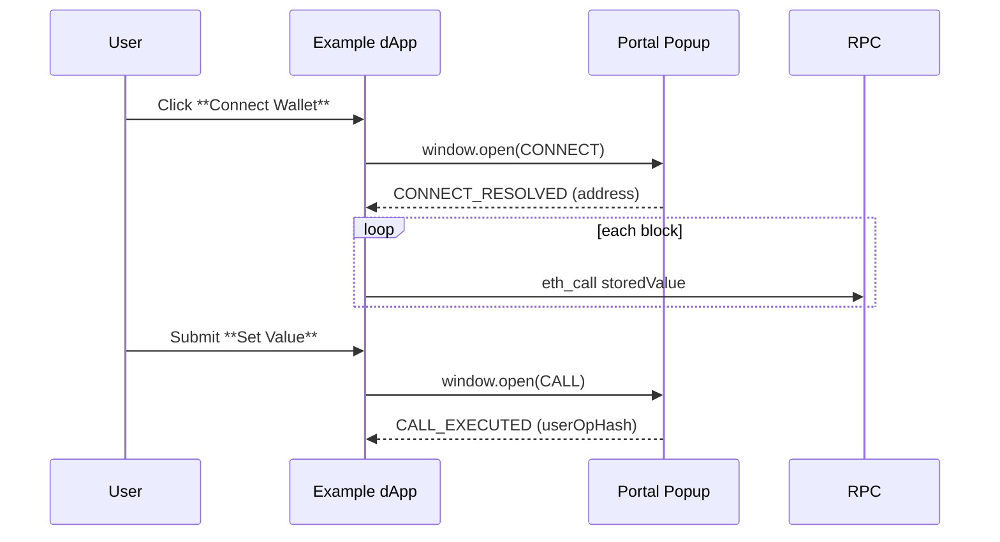

# Incentiv dApp SDK Example App

A minimal **React + TypeScript** demo that shows how to integrate the [Incentiv dApp SDK](https://www.npmjs.com/package/@incentiv/dapp-sdk) in a modern front‑end stack.

---

## What you’ll learn

* Connecting to the **Incentiv Portal** and retrieving the user’s account address
* Creating an `ethers` provider and the SDK’s `IncentivSigner`
* Reading on‑chain state from a simple **Storage** contract
* Triggering a transaction that opens the Portal pop‑up and submits an ERC‑4337 *UserOperation*
* React hooks for real‑time UI updates

---

## Tech stack

| Tool              | Purpose                              |
| ----------------- | ------------------------------------ |
| Vite              | Development server and bundler       |
| React 18          | UI framework                         |
| TypeScript        | Type safety                          |
| Tailwind CSS      | Utility‑first styling                |
| ethers v5         | Ethereum RPC + contract ABI bindings |
| Incentiv dApp SDK | Proprietary signing & submission     |

---

## Quick start

```bash
# 1. Clone the SDK repository (or copy only the /example folder)
git clone https://github.com/incentiv-network/incentiv-dapp-sdk.git
cd incentiv-dapp-sdk/example

# 2. Install dependencies – the SDK is pulled from the parent folder via the "file:" reference in package.json
npm install

# 3. Run the dev server (default: http://localhost:5173)
npm run dev
```

> **Note on dependencies**
> You do **not** need to install `@incentiv/dapp-sdk` separately when using this example. The `package.json` already references the SDK via `"file:.."`, which points one directory up to the local source. If you publish or move the example outside the monorepo, change that line to `"@incentiv/dapp-sdk": "^x.y.z"` and re‑install.

---

## Configuration

Network and contract settings live in **`src/config.ts`**:

```ts
const Config = {
  Environments: {
    Local:   { Portal: "http://localhost:8080", RPC: "https://rpc1.testnet.incentiv.net", Contract: "0x…" },
    Staging: { Portal: "https://staging.incentiv.net", RPC: "https://rpc.staging.incentiv.net", Contract: "0x…" },
    Testnet: { Portal: "https://testnet.incentiv.net", RPC: "https://rpc1.testnet.incentiv.net", Contract: "0x…" }
  },
  ABI: [ /* simplified Storage ABI */ ]
};
```

Switch environments in **`src/App.tsx`** by modifying:

```ts
const Environment = Config.Environments.Testnet;
```

---

## App anatomy

### 1. `src/App.tsx`

* **`handleConnect`** – asks the SDK for an account address and sets up the provider & signer.
* **`handleFetchData`** – reads `storedValue()` and `lastSetter()` from the Storage contract.
* **`handleSubmit`** – calls `setValue()`; the SDK opens the Portal for signing and then shows a success/error modal.
* A `useEffect` hook listens for new blocks and keeps the UI in sync.

### 2. `src/components/Modal.tsx`

Reusable modal component used for success/error feedback.

---

## Runtime flow



---

## Troubleshooting

| Symptom                              | Possible cause & fix                                            |
| ------------------------------------ | --------------------------------------------------------------- |
| Pop‑up opens then closes immediately | The user closed it or rejected the Portal request.              |
| `Popup closed` error in console      | Same as above – re‑try and approve the Portal prompt.           |
| `Failed to connect wallet`           | Wrong Portal URL in `config.ts` or you’re on a different chain. |

---

## Production build

```bash
npm run build   # Output files are written to /dist
npm run preview # Preview the production build locally
```

Ensure your production host allows pop‑ups for the Incentiv Portal domain.

---

## License

MIT – provided “as‑is” for educational purposes.